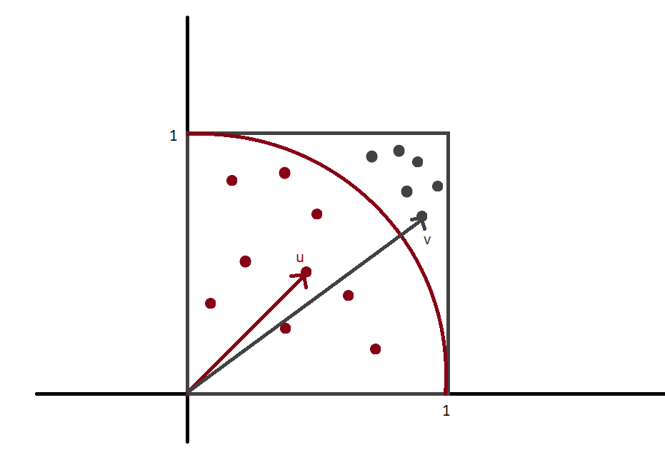

Pi number () , by definition, is a mathematical constant that is used to calculate a circle's circumference and area or a sphere's volume. We can calculate Pi by finding the ratio of a circle's circumference to its diameter: . An experiment that we can try is wrapping a circle using a string of yarn or thread or any material that we can use to wrap a full round of the circle. Then, we can cut the string to get exactly one round of the circle. The length of this string is the circumference of the circle we are having. We may continue with measuring the diameter of the same circle, then take the length of the string we cut and divide it by the diameter, we will have an estimation of Pi number, which is around 3.1415. \
There are many diffrent methods used to calculate this constant, but in this post, I'm going to show how I would estimate Pi using only random numbers between 0 and 1. \
Let's take a look at the unit circle. If we only conside the 1st quarter of the unit circle and of the square circumscribing this circle, we have the following graphs:\

\Let's mark the dots inside the circle as the red dots and the ones outside the circle are gray ones. 
If we denote the vector from the origin of the coordinate a red dot is u and the vector from the origin to the 

